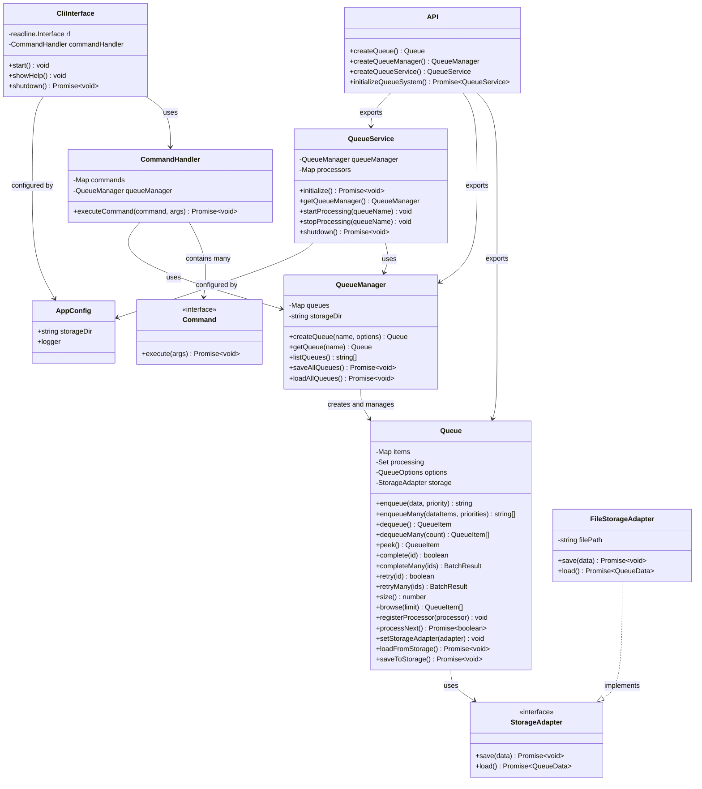
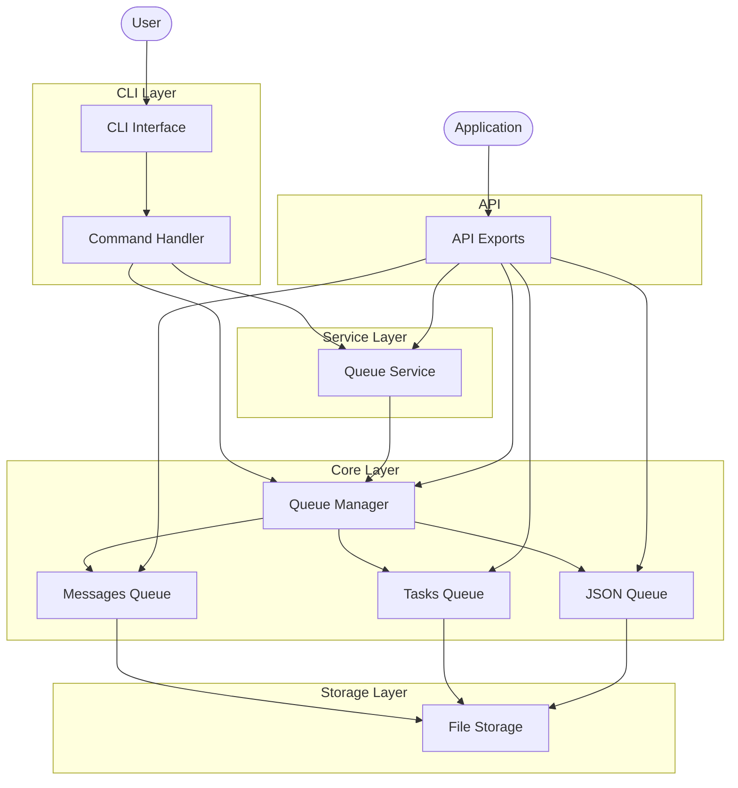
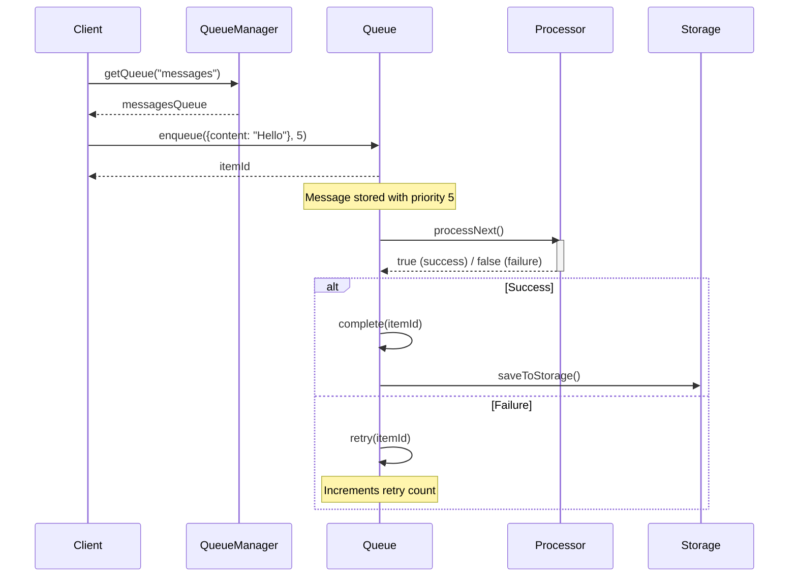
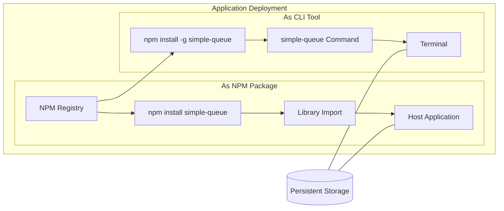

# System Architecture

This document provides a visual representation of the Simple Queue System's architecture.

## Class Diagram

## Component Diagram

## Sequence Diagram: Message Processing

## Deployment Diagram

